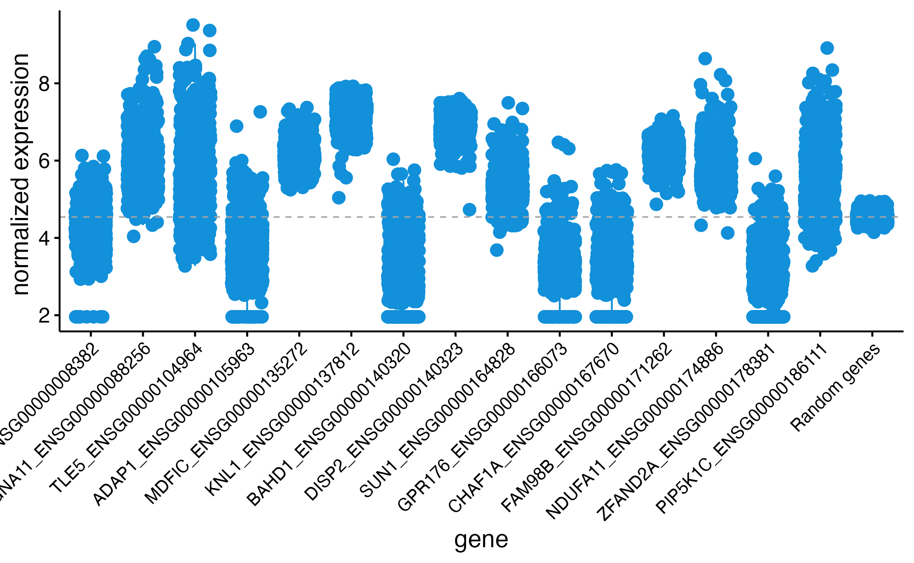
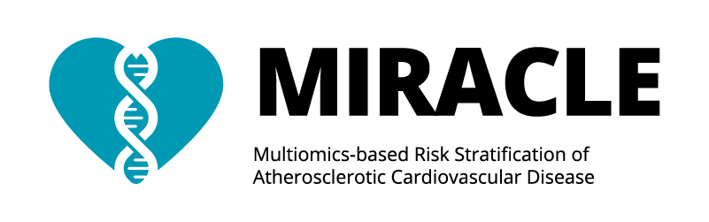

<!--  Provide a title.         -->
## Genomics-based identification of shared mechanism in different tissues connecting major depression with atherosclerotic disease

<!--  Provide details on the people involved and the project ID.         -->
*Collaborators*

Emma Pruin, Meike Bartels, Noortje van den Dungen, Joost Hoekstra, Dominique D.P. de Kleijn, Michal Mokry, Gerard Pasterkamp, Brenda Penninx, Wouter Peyrot, Hester M. den Ruijter, S.W. van der Laan, PhD*, Y. Milaneschi, PhD*.
* these authors contributed equally

**Project ID** [`MR_CVD_MDD`]

### Background
<!--  Provide some background, study design, results, etc.         -->
The high comorbidity of depression and atherosclerotic diseases may be linked to shared biological processes. The main process of atherosclerosis, the buildup of plaques in the vascular system, has not been investigated in connection with depression. Here, we examined whether the shared genetic basis of major depressive disorder (MDD) and atherosclerotic diseases was linked to altered gene expression in specific tissues, including the atherosclerotic plaque.

### Methods
Regions of high probability for shared causal genetic variants were identified using a combined approach of Mendelian Randomization and colocalization based on summary statistics of the newest available GWAS (N_MDD = 3,887,532). Shared causal regions were submitted to SMR-HEIDI, testing for effects of gene expression on MDD. Alongside eQTL datasets for whole blood (eQTLGen, N = 31,684), brain (BrainMeta, N = 2,865), and various other tissues (GTEx, N  > 134), we leverage eQTL from atherosclerotic plaques (Athero-Express, N = 656). 

### Results
We found eight genomic regions with high (> 0.8) posterior probability for containing shared causal variants for MDD and atherosclerotic disease. Significant causal estimates of gene expression on MDD were found in tissues such as whole blood, brain, and heart. No significant causal estimates were found for the effect of gene expression in the atherosclerotic plaque on depression. 

### Conclusion
This study indicates that the shared genetic vulnerability with atherosclerosis acts on MDD partially through expression of various genes in tissues such as whole blood and the brain. Gene expression in severe atherosclerotic lesions did not appear to be involved in disease mechanisms.

**Figure 1: Genotyped individuals in the Athero-Express Biobank Study**

#### Whole-plaque RNAseq

For the expression analysis we used carotid plaque-derived bulk RNAseq data and queried it for the gene list. Below a graph showing the overall expression of the genes (not all are in the data) compared to the mean expression of 1,000 randomly picked genes. 

**Figure 2: Overall expression of target genes in carotid plaques from the Athero-Express Biobank Study**

#### Single cell RNAseq

We projected target genes to the single-cell RNAseq data derived from 37 carotid plaque samples. We identified cell communities (Figure 2), mapped and projected target gene expression to the cell communities (Figure 3). 

**Figure 3: Cell communities identified in carotid plaques from the Athero-Express Biobank Study**

**Figure 4: Dotplot showing expression of target genes per cell type in carotid plaques from the Athero-Express Biobank Study**

### Where do I start?

You can load this project in RStudio by opening the file called 'MR_CVD_MDD.Rproj'.

### Project structure

<!--  You can add rows to this table, using "|" to separate columns.         -->

File                                    | Description                          | Usage         
--------------------------------------- | ------------------------------------ | --------------
README.md                               | Description of project               | Human editable
MR_CVD_MDD.Rproj                        | Project file                         | Loads project
LICENSE                                 | User permissions                     | Read only
.worcs                                  | WORCS metadata YAML                  | Read only
renv.lock                               | Reproducible R environment           | Read only
images                                  | image directory for project          | Human editable
BASELINE                                | Baseline characteristics directory   | Human editable
OUTPUT                                  | Output directory                     | Human editable
PLOTS                                   | Some results                         | Human editable
scripts                                 | Scripts directory                    | Human editable
targets                                 | Directory containing list of targets | Human editable
packages.bib                            | BibTex references for packages used  | Human editable
references.bib                          | BibTex references                    | Human editable
preregistration.rmd                     | Preregistered hypotheses             | Human editable
1_AEDB.CEA.baseline.Rmd                 | Preparing data, baseline table       | Human editable
3_1_bulkRNAseq.preparation.Rmd          | Preparing bulk RNAseq analyses       | Human editable
3_2_bulkRNAseq.exploration.Rmd          | Exploration RNAseq.                  | Human editable
4_scRNAseq.Rmd                          | Single-cell RNAseq analyses          | Human editable
6_Parsing_AE_molQTL.ipynb               | Parsing molQTL results               | Human editable
7_Parsing_GWASSumStats_MDD_vs_CAD.ipynb | Parsing GWAS SumStats MDD vs CAD     | Human editable
8_Extract_8_regions.ipynb               | Extract data for regions of interest | Human editable

<!--  You can consider adding the following to this file:                    -->
<!--  * A citation reference for your project                                -->
<!--  * Contact information for questions/comments                           -->
<!--  * How people can offer to contribute to the project                    -->
<!--  * A contributor code of conduct, https://www.contributor-covenant.org/ -->

### Reproducibility

This project uses the Workflow for Open Reproducible Code in Science (WORCS) to ensure transparency and reproducibility. The workflow is designed to meet the principles of Open Science throughout a research project. 

To learn how WORCS helps researchers meet the TOP-guidelines and FAIR principles, read the preprint at https://osf.io/zcvbs/

#### WORCS: Advice for authors

* To get started with `worcs`, see the [setup vignette](https://cjvanlissa.github.io/worcs/articles/setup.html)
* For detailed information about the steps of the WORCS workflow, see the [workflow vignette](https://cjvanlissa.github.io/worcs/articles/workflow.html)

#### WORCS: Advice for readers

Please refer to the vignette on [reproducing a WORCS project]() for step by step advice.
<!-- If your project deviates from the steps outlined in the vignette on     -->
<!-- reproducing a WORCS project, please provide your own advice for         -->
<!-- readers here.                                                           -->

# Acknowledgements
Dr. Sander W. van der Laan is funded through EU H2020 TO_AITION (grant number: 848146), EU HORIZON NextGen (grant number: 101136962), EU HORIZON MIRACLE (grant number: 101115381), and Health~Holland PPP Allowance ‘Getting the Perfect Image’.

We are thankful for the support of the Leducq Fondation ‘PlaqOmics’ and ‘AtheroGen’, and the Chan Zuckerberg Initiative ‘MetaPlaq’. The research for this contribution was made possible by the AI for Health working group of the [EWUU alliance](https://aiforhealth.ewuu.nl/). The collaborative project ‘Getting the Perfect Image’ was co-financed through use of PPP Allowance awarded by Health~Holland, Top Sector Life Sciences & Health, to stimulate public-private partnerships.

Plaque samples are derived from endarterectomies as part of the [Athero-Express Biobank Study](https://doi.org/10.1007/s10564-004-2304-6) which is an ongoing study in the UMC Utrecht. We would like to thank all the (former) employees involved in the Athero-Express Biobank Study of the Departments of Surgery of the St. Antonius Hospital Nieuwegein and University Medical Center Utrecht for their continuing work. Lastly, we would like to thank all participants of the Athero-Express Biobank Study; without you these kinds of studies would not be possible.

The framework was based on the [`WORCS` package](https://osf.io/zcvbs/).

## Disclosures
Dr. Sander W. van der Laan has received Roche funding for unrelated work.

        

#### Changes log
    
    _Version:_      v1.4.1 
    _Last update:_  2025-04-10 
    _Written by:_   Sander W. van der Laan (s.w.vanderlaan-2[at]umcutrecht.nl).
    
    **MoSCoW To-Do List**
    The things we Must, Should, Could, and Would have given the time we have.
    _M_

    _S_

    _C_

    _W_

    **Changes log**
    * v1.4.1 Fixed some issues with writing the baseline tables. 
    * v1.4.0 Total re-organization. Updated to AEDB. Updated to RNAseq (deeper sequencing). Added baseline table for samples in eQTL analyses (b37 version).
    * v1.3.1 Fixed baseline table writing. Added additional saving options (raw, normalized, and log-transformed data) for the bulk RNAseq.
    * v1.3.0 Some script changes. Update to AEDB. Update to RNAseq (deeper sequencing). 
    * v1.2.2 Some organisational updates. 
    * v1.2.1 Fixed some references in the README.md. 
    * v1.2.0 There were some critical fixes in the way each notebook starts. Updates to the way the local system is set up and packages are loaded. Updates to functions. Updates to the organisation of the various notebooks. 
    * v1.1.0 Major update to WORCS system. 
    * v1.0.6 Small bug fixes. 
    * v1.0.5 Added png for overlap-figure.
    * v1.0.5 Removed obsolete references to objects.
    * v1.0.4 Fixed a mistake in the chr X sample-file creation. Now the order matches the chr X data.
    * v1.0.3 Fixed weight of files (limit of 10Mb per file for templates). Renamed entire repo.
    * v1.0.2 Added sex-specific .sample-files. Added GWASToolKit input-files.
    * v1.0.0 Initial version. Add 'plaque vulnerability index', Fixed baseline table, added codes, and results. Created sample-files. 

--------------

#### Creative Commons BY-NC-ND 4.0
##### Copyright (c) 1979-2025 Sander W. van der Laan | s.w.vanderlaan [at] gmail [dot] com.

This is a human-readable summary of (and not a substitute for) the [license](LICENSE). 
 
You are free to share, copy and redistribute the material in any medium or format. The licencor cannot revoke these freedoms as long as you follow the license terms. 
 
Under the following terms:  
<em>- Attribution</em> — You must give appropriate credit, provide a link to the license, and indicate if changes were made. You may do so in any reasonable manner, but not in any way that suggests the licensor endorses you or your use. 
<em>- NonCommercial</em> — You may not use the material for commercial purposes. 
<em>- NoDerivatives</em> — If you remix, transform, or build upon the material, you may not distribute the modified material. 
<em>- No additional</em> restrictions — You may not apply legal terms or technological measures that legally restrict others from doing anything the license permits. 
 
Notices:  
You do not have to comply with the license for elements of the material in the public domain or where your use is permitted by an applicable exception or limitation.
No warranties are given. The license may not give you all of the permissions necessary for your intended use. For example, other rights such as publicity, privacy, or moral rights may limit how you use the material.

